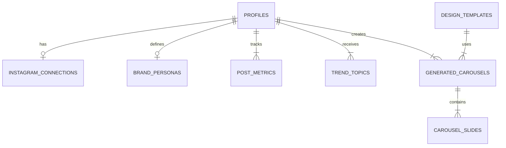

# Arquitetura e Modelagem de Dados: AgentForCreator 🚀

Como Arquiteto de Sistemas Sênior, projetei a fundação do **AgentForCreator** focando em escalabilidade, integrações assíncronas (fundamentais para processamento de IA e geração de imagens) e na separação clara de responsabilidades entre as fases do seu plano de ação.

Abaixo, detalho a modelagem do banco de dados relacional para o **PostgreSQL (Supabase)**, além de recomendações arquiteturais para o ecossistema (Next.js + NestJS).

---

## 1. Modelagem de Banco de Dados (Supabase / PostgreSQL)

A modelagem utiliza o sistema de autenticação nativo do Supabase (`auth.users`) estendido através de tabelas no schema `public`.

### Diagrama Lógico de Tabelas Principais

### Detalhamento das Tabelas (DDL)

#### 1.1 Tabelas de Usuário e "Raio-X" (Fase 1)

**`profiles`**
Extensão do usuário logado.
- `id` (uuid, PK, FK -> auth.users.id)
- `full_name` (text)
- `email` (text)
- `subscription_tier` (enum: 'free', 'pro', 'agency')
- `created_at` (timestamp)

**`instagram_connections`**
Armazena os tokens de acesso de forma segura.
- `id` (uuid, PK)
- `profile_id` (uuid, FK -> profiles.id)
- `ig_user_id` (text, ID do Instagram Graph)
- `username` (text)
- `access_token` (text, idealmente criptografado no NestJS antes de salvar)
- `token_expires_at` (timestamp)
- `status` (enum: 'active', 'expired', 'disconnected')

**`brand_personas`** (O motor do Tom de Voz e Nicho)
Resultado do processamento da IA sobre o histórico do criador.
- `id` (uuid, PK)
- `profile_id` (uuid, FK -> profiles.id)
- `nicho_principal` (text)
- `subnichos` (jsonb)
- `pontos_fortes` (jsonb)
- `pontos_fracos` (jsonb)
- `fator_viralizacao` (numeric)
- `resumo_psicologico` (text)
- `publico_alvo` (text)
- `posicionamento` (text)

#### 1.2 Tabelas do Motor de Inteligência (Fase 2)

**`post_metrics`** (Benchmarking do que já deu certo)
- `id` (uuid, PK)
- `profile_id` (uuid, FK -> profiles.id)
- `ig_media_id` (text, ID original da postagem)
- `media_type` (enum: 'IMAGE', 'CAROUSEL_ALBUM', 'VIDEO')
- `caption` (text)
- `engagement_score` (numeric, calculado internamente via algoritmo próprio)
- `metrics` (jsonb, ex: `{ likes: 1200, comments: 45, shares: 330, saves: 500 }`)
- `posted_at` (timestamp)

**`trend_topics`** (Pautas sugeridas pela IA/Perplexity)
- `id` (uuid, PK)
- `profile_id` (uuid, FK -> profiles.id)
- `source` (text, ex: 'Perplexity', 'Google Trends')
- `topic_title` (text)
- `context_summary` (text, resumo da notícia ou trend)
- `relevance_score` (int, 0-100)
- `status` (enum: 'suggested', 'accepted', 'rejected', 'used')
- `created_at` (timestamp)

#### 1.3 Tabelas da Fábrica e Design (Fase 3)

**`design_templates`** (Seus 3 estilos iniciais)
- `id` (uuid, PK)
- `name` (text, ex: 'O Educativo', 'O Storytelling', 'O Viral/News')
- `design_schema` (jsonb, configurações estruturais para o Canvas/Fabric.js)
- `base_constraints` (jsonb, ex: restrição de caracteres por slide)
- `is_active` (boolean)

**`generated_carousels`**
Representa a "peça de conteúdo" inteira.
- `id` (uuid, PK)
- `profile_id` (uuid, FK -> profiles.id)
- `trend_topic_id` (uuid, nulo se criado do zero)
- `template_id` (uuid, FK -> design_templates.id)
- `main_caption` (text, a legenda para o Instagram gerada pela IA)
- `status` (enum: 'draft', 'generating_copy', 'generating_images', 'rendering_design', 'ready', 'published')
- `created_at` (timestamp)
- `updated_at` (timestamp)

**`carousel_slides`**
O detalhe visual e textual de cada "página" do carrossel. O design engine vai ler isso para renderizar.
- `id` (uuid, PK)
- `carousel_id` (uuid, FK -> generated_carousels.id)
- `slide_order` (int, 1 a 10)
- `copy_text` (text, o texto gerado para este slide)
- `ai_image_prompt` (text, o prompt usado no Midjourney/Nano Banana)
- `generated_image_url` (text, URL no Supabase Storage)
- `final_render_url` (text, imagem final text + fundo mesclados e renderizados)

---

## 2. Decisões Arquiteturais

### Frontend (Next.js)
- **UI/UX:** O uso do Next.js permite implementar Server Components. Para o MVP, concentre-se em carregar a tipografia *Poppins* usando `next/font/google` para evitar CLS (Cumulative Layout Shift) e manter o aspecto minimalista.
- **Preview de Interface:** Ao montar as páginas de preview de carrossel, evite renderizar a imagem final no frontend enquanto o usuário edita o texto. Use HTML/CSS com marcação pesada para simular o card do carrossel em tempo real, enviando para o backend renderizar a "imagem dura" em `.png` apenas na hora do download ou postagem final.

### Backend (NestJS)
Sendo um SaaS voltado para geração de IA e imagens, o backend **não pode travar esperando respostas síncronas**.
- **Message Broker / Filas (BullMQ + Redis):** É estritamente necessário. O NestJS receberá a requisição do usuário de "Gerar Carrossel". Ele responde `202 Accepted` com um ID de tarefa. A geração segue o fluxo em fila estruturada:
  1. *Worker de Copy:* Chama a LLM (passando a Brand Persona + Trend) e gera os textos descritivos que irão em cada slide.
  2. *Worker de Imagem:* Chama o Midjourney via API (ou equivalente) para gerar as ilustrações de fundo base.
  3. *Worker de Render:** (Canvas API ou Puppeteer no backend) Pega as imagens de fundo e desenha os textos por cima usando o layout do `design_templates`. Faz o upload dos PNGs finais para o Supabase Storage.

### Inteligência de Conteúdo.
O **Retrieval-Augmented Generation (RAG)** será seu melhor amigo. Em vez de passar os 100 últimos posts do usuário para a LLM sempre que for gerar um copy (o que é caro e ineficiente), você envia a tabela `brand_personas` que atua como um "sumário condensado" do criador.

### Engine de Design (Ponto Crítico)
Recomendo **não** tentar manipular pixels manualmente no backend no início (usando bibliotecas de baixo nível de ImageMagick caso haja muito texto dinâmico).
**Sugestão de MVP para o Engine:**
Crie uma rota pequena (podendo até ser no próprio Next.js via API Routes) que gera uma página HTML (tamanho 1080x1350) e use o **Puppeteer** (via uma cloud function serverless, como um Lambda ou o próprio Node) para tirar uma *screenshot* daquele HTML.
- **Por quê?** HTML + CSS (+ Tailwind/Vanilla CSS) usa o motor do navegador, lidando perfeitamente com *word-wrap*, alinhamentos complexos e a fonte Poppins perfeitamente. Colocar texto em cima de imagens nativamente com bibliotecas Canvas no backend (como `node-canvas`) gera muita dor de cabeça com quebra de linha de texto e rendering de fontes em servidores Linux.
